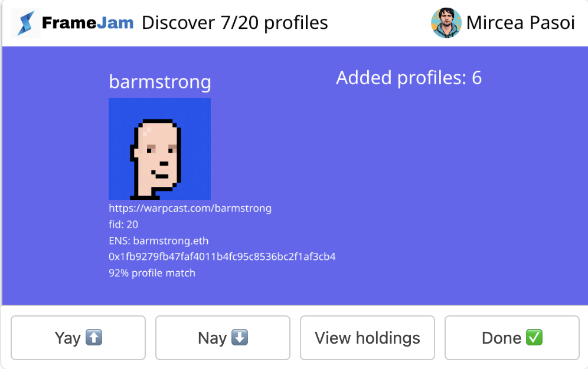
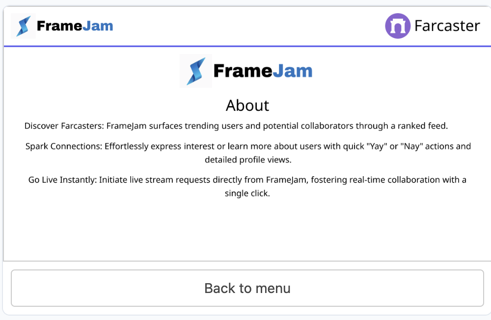
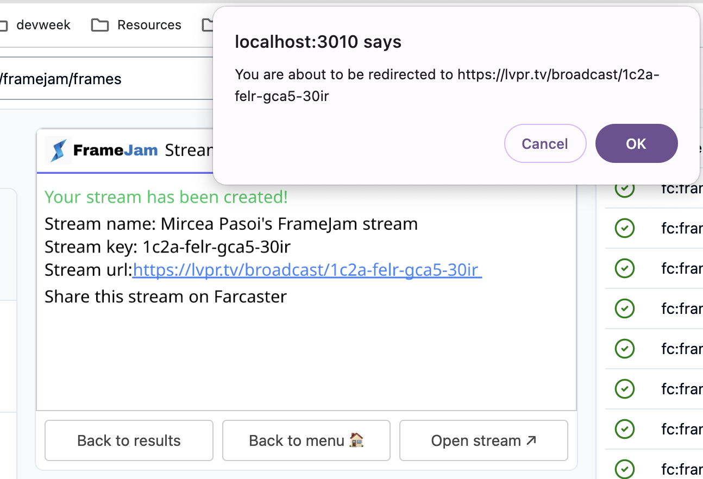
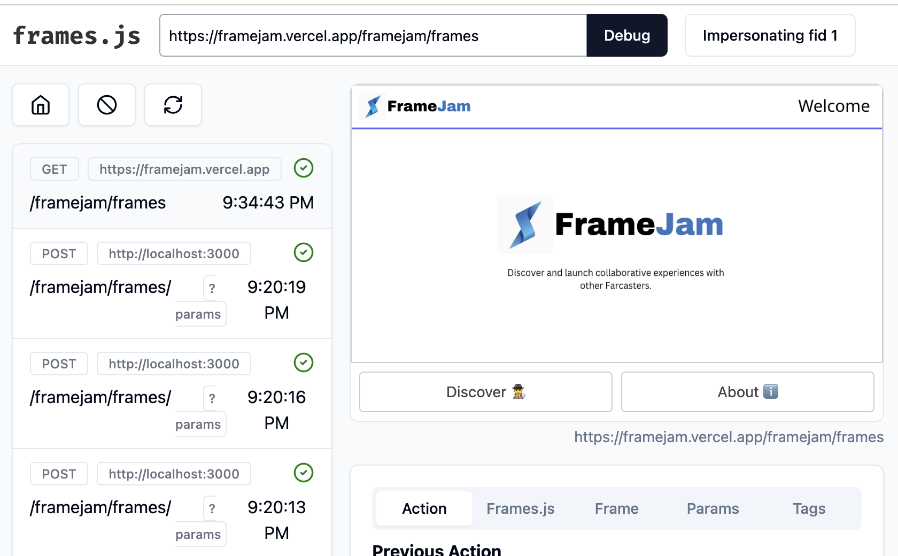
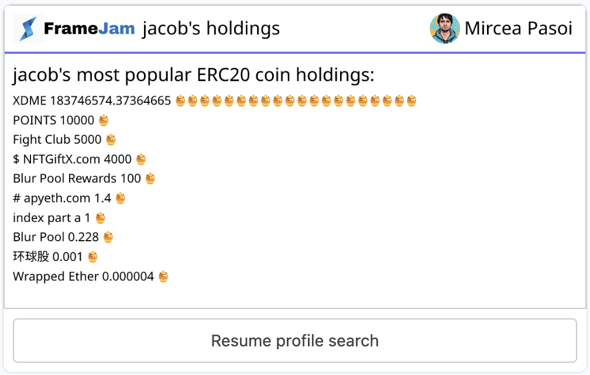
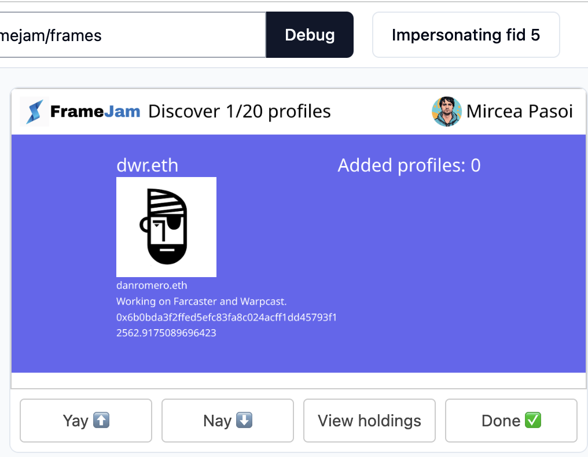
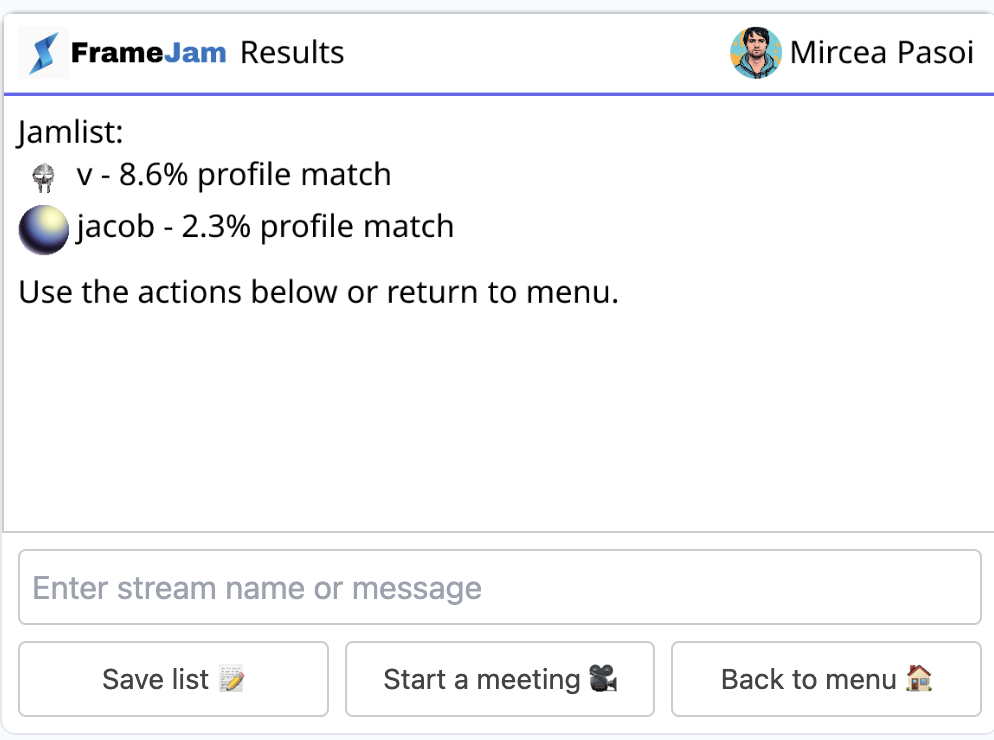

<p align='center'>
  <a href="https://github.com/cbonoz/frame24"></a>
</p>

# FrameJam P2P

Discover and launch collaborative experiences with other Farcasters.

FrameJam is a frame app that uses ranked indexes of Farcast users to find trending individuals connected to you and globally.

Built for the Frameworks 2024 hackathon.

---

Frame demo URL: https://framejam.vercel.app/framejam/frames

Warpcast embed url: <a href="https://warpcast.com/~/developers/frames?url=https%3A%2F%2Fframejam.vercel.app%2Fframejam%2Fframes" target="_blank">Warpcast dev link</a>

Demo video:

## What it does

Scroll through forecasters on their relevance score. Click yay or nay on each recommended individual based on shared interests, then trigger a live stream creation request or cast directly from the frame.

## Inspiration

On many, social networks, people you should follow sections have been similar for almost 20 years. You see a list of profiles you should follow and you're able to one-click follow them. FrameJam enhances this experience and embeds it using Farcaster frames.

The inspiration behind FrameJam stems from the growing need for real-time collaboration and networking within Farcaster community. As users ourselves, we often want to discover individuals who align with our interests or could potentially contribute to collaborative projects. This inspired us to develop a platform that not only simplifies the process of discovering like-minded individuals but also facilitates seamless collaboration through live streaming capabilities.

When a user is scrolling, he/she can connect with the top Farcaster accounts and broaden their own networks in the process.

<!-- >
## How it works

Our project incorporates a variety of technologies to enhance the social networking experience. Frames.js serves as the foundational framework, enabling rapid prototyping and development while ensuring seamless rendering of dynamic content and managing user interactions with Farcaster accounts.

Powering connection ranking and discovery, Karma3 APIs are used to provide personalized recommendations based on user behavior, enhancing usability and fostering meaningful connections. Leveraging social and web3 data integration,

Airstack enriches user encounters by providing deeper insights into individuals' ERC20 currency holdings, fostering transparency and authenticity in interactions and potential interest overlap.. Pinata Frame Analytics tracks user engagement metrics, providing valuable insights into user behavior and empowering data-driven decision-making and continuous platform optimization.

Finally, Livepeer facilitates one-click stream initiation, seambdwlessly integrating real-time communication capabilities to ensure high-quality and uninterrupted live streams for dynamic collaboration experiences.

-->

### Example of matching profile on FrameJam

<p align='center'>
  
</p>

## Technologies used:

- <b>Frames.js</b>: Utilized as the foundational framework, frames.js enables rapid prototyping and development while ensuring seamless rendering of dynamic content and managing user interactions. The app is deployed on Vercel using Vercel serverless functions and API responses.

- <b>Karma3</b>: Powering connection ranking and discovery, Karma3 employs sophisticated algorithms to provide personalized recommendations based on user behavior, enhancing usability and fostering meaningful connections.

- <b>Pinata API and Analytics</b>: Tracking user engagement metrics, Pinata Frame Analytics provides valuable insights into user behavior, empowering data-driven decision-making and continuous platform optimization. The Pinata API is also used to hydrate the active user's authentication/Farcaster data.

- <b>Airstack</b>: Leveraging social and web3 data integration, Airstack enriches user encounters by providing deeper insights into individuals' online presence, fostering transparency and authenticity in interactions.

- <b>Livepeer</b>: Facilitating one-click stream initiation, Livepeer seamlessly integrates real-time communication capabilities, ensuring high-quality and uninterrupted live streams for dynamic collaboration experiences.

<!-- - frames.js: foundation of Frame.
- Karma3: connection ranking and discovery
- Airstack: social and web3 data for encountered users
- The graph: index of user content
- Pinata Frame analytics: user engagement. Find top ranked profiles.
- Livepeer initiate a stream / broadcast with one click (opens external window). -->

## Challenges we ran into

- Integration Hurdles: Bringing together disparate technologies like Karma3 and Livepeer presented integration challenges due to their diverse APIs and data formats. We tackled this by swiftly prototyping and iteratively refining our integration strategies until we achieved seamless interoperability.
- Working within the Frame context: While secure, the frame context doesn't offer full client-side html or web experience.

## Accomplishments that we're proud of

Was able to successfully integrate the different sponsors to build an app the validates the existing use case of profile discovery and instant meetings/networking based on shared asset and project interests.

## What we learned

- The frames.js framework and set up Farcaster! Was great getting exposure to some of this new embedded technology for building secure decentralized apps.

## What's next for FrameJam

FrameJam is open source, live, and deployed on vercel.

## Repo structure

`/` (root): Main web project

## How to run

1. Copy file from `.env.sample` -> `.env` and fill with your own values

2. `yarn; yarn dev`

The frame should now be running on port 3000

Debugger on port 3010.

### Useful links

- Dashboard: https://ethglobal.com/events/frameworks/home
- Sponsors: https://ethglobal.com/events/frameworks

https://docs.pinata.cloud/farcaster/fdk

### Potential Future work

1. Enhanced Recommendation Algorithm: Implement additional ranking methods to expand on profile recommendation logic, considering factors such as user engagement, content similarity, and collaborative filtering to deliver more accurate and personalized suggestions.

2. Social Integration: Integrate with popular social media platforms to allow users to import their social network connections, enriching the discovery process and facilitating connections with friends and acquaintances.

3. Interactive Collaboration Tools: Develop interactive collaboration features such as real-time document editing, shared whiteboards, and group chat functionalities to enable users to collaborate seamlessly on projects and discussions within the platform.

4. Community Building Initiatives: Launch community-building initiatives such as forums, discussion boards, and virtual events to foster engagement, facilitate knowledge sharing, and strengthen the sense of belonging among users.

5. Monetization Strategies: Explore monetization strategies such as premium subscriptions, sponsored content, and targeted advertising to generate revenue while maintaining a positive user experience and value proposition for users.

### Screenshots
<h2 align="center">About</h2>
<p align="center">
  
</p>

<h2 align="center">Added</h2>
<p align="center">
  
</p>

<h2 align="center">Broadcast</h2>
<p align="center">
  
</p>

<h2 align="center">Debug</h2>
<p align="center">
  
</p>

<h2 align="center">Holdings</h2>
<p align="center">
  
</p>

<h2 align="center">Main</h2>
<p align="center">
  
</p>

<h2 align="center">Matches</h2>
<p align="center">
  
</p>

<h2 align="center">Profile</h2>
<p align="center">
  
</p>

<!--
# Frames.js Starter Kit

This is a boilerplate repo to get started quickly with `frames.js`

## Quickstart

If running from the frames.js repository itself:

- Run `yarn` from the repository root
- Run `cd examples/framesjs-starter`

1. Install dependencies `yarn install`

2. Run the dev server `yarn dev`

3. Open [http://localhost:3000](http://localhost:3000) with your browser to see the result.

4. Edit `app/page.tsx`

5. Visit [http://localhost:3000/debug](http://localhost:3000/debug) to debug your frame.

6. (Optional) To use a real signer (costs warps), copy `.env.sample` to `.env` and fill in the env variables following the comments provided

## Docs, Questions and Help

- [Frames.js Documentation](https://framesjs.org)
- [Awesome frames](https://github.com/davidfurlong/awesome-frames?tab=readme-ov-file)
- Join the [/frames-dev](https://warpcast.com/~/channel/frames-devs) channel on Farcaster to ask questions

## If you get stuck or have feedback, [Message @df please!](https://warpcast.com/df)

You can check out [the Next.js GitHub repository](https://github.com/vercel/next.js/) - your feedback and contributions are welcome!

## Deploy

```bash
vercel
```

more deployment links coming soon, PRs welcome!
-->
